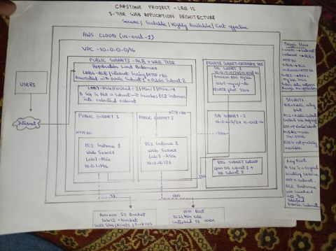

# ☁️ Enterprise-Grade 3-Tier Web Application on AWS

A production-style, secure 3-tier web application architected and deployed end-to-end on AWS — covering networking, compute, database, identity, storage, serverless, and cost governance in a single environment.



---

## 🚀 Overview

This project is a fully deployed 3-tier system on AWS, designed with real-world production practices in mind — strict network segmentation, least-privilege access, and zero direct internet exposure for the data tier.

---

## 🏗️ Architecture & Security Highlights

- **Custom VPC** — Multi-AZ public and private subnet isolation with strict route table segmentation.
- **Web Tier** — Scalable EC2 fleet fronted by an Application Load Balancer (ALB) and dynamic Auto Scaling Groups (ASG).
- **Database Tier** — Amazon RDS (MySQL) isolated strictly within private subnets, with zero direct internet access.
- **Identity & Access** — Scoped IAM roles with least-privilege policies, eliminating hardcoded credentials on instances.
- **Storage & Serverless** — S3 for static assets, alongside Lambda + API Gateway for event-driven execution.
- **Governance** — Proactive cost and usage tracking using AWS Budgets and Cost Explorer.

**Core design takeaway:** the database is reachable only via the web tier's dedicated security group — enforced at the network layer itself, not application logic alone. Even in the event of credential leakage, there is zero routable path from the public internet to the data tier.

---

## 🧰 Tech Stack

`AWS VPC` `EC2` `IAM` `S3` `RDS (MySQL)` `Application Load Balancer` `Auto Scaling Groups` `Docker` `Lambda` `API Gateway` `AWS Budgets / Cost Explorer` `PHP`

---

## 🔐 Security Model

```
Internet → ALB (public subnet) → EC2 Web Tier (public subnet)
                                        │
                          Security-group-scoped connection only
                                        ▼
                          RDS MySQL (private subnet, no public IP)
```

No inbound rule on the database security group accepts traffic from `0.0.0.0/0` — only from the web tier's security group, on port 3306.

---

## 📸 Screenshots

Deployment and architecture screenshots are available in the [`images/`](images) folder.

---

## 📂 Repository Structure

```
aws-3tier-webapp/
├── README.md
├── images/
│   ├── architecture-diagram.png
│   └── deployment-screenshots/
├── app/
│   └── index.php
└── scripts/
    └── setup-web-server.sh
```

---

## 👤 Author

**Muhammad Bilal**
AWS Cloud Engineer | Growing into DevOps — Linux, Docker, CI/CD
Karachi, Pakistan
[LinkedIn](www.linkedin.com/in/muhammad-bilal-977001399) · [GitHub](https://github.com/MuhammadBilal-devOps)
